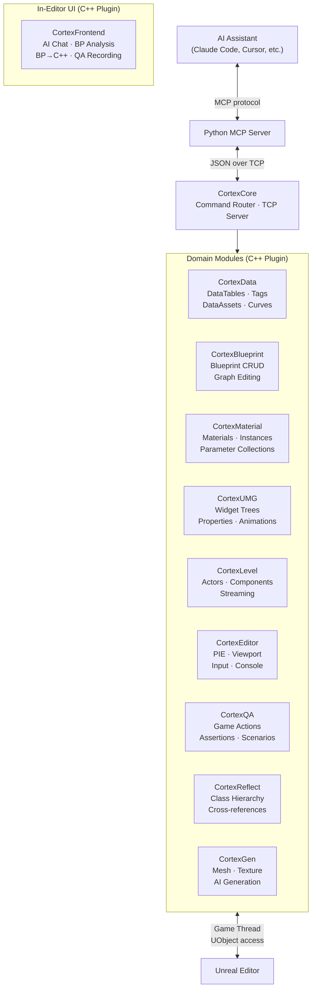

# UnrealCortex

<p align="center">
  
  
  
  
  
</p>

**Give your AI hands inside Unreal Engine.**

Your AI assistant can already write code. UnrealCortex lets it work *inside* the editor — querying DataTables, editing Blueprint graphs, building UMG hierarchies, placing actors, converting Blueprints to C++, analyzing Blueprints for bugs and performance issues, generating 3D assets, and even playing and testing your game autonomously. No copy-pasting, no file exports. Changes appear live with full undo support.

> **Status:** v0.1.0 Beta — All 12 modules shipped and tested.

---

## What AI Can Do

<details>
<summary><strong>Data — CortexData</strong> &nbsp;·&nbsp; 26 commands &nbsp;·&nbsp; DataTables, GameplayTags, DataAssets, CurveTables, StringTables</summary>

<br>

| Subsystem | Capabilities |
|-----------|-------------|
| **DataTables** | Query rows with wildcard filters, inspect schemas, add/update/delete rows, bulk import with dry-run, search across all tables, full CompositeDataTable awareness |
| **GameplayTags** | Browse tag hierarchies, validate tags, register new tags with auto `.ini` routing |
| **DataAssets** | List by class, inspect any property via reflection, partial field updates |
| **CurveTables** | Read time/value curves, modify keys |
| **StringTables** | Browse entries, update translations |
| **Asset Search** | Find any asset by name, class, or path |

Every mutation wrapped in `FScopedTransaction`. Large responses auto-truncate with metadata so the AI knows what it's working with.

**Example tasks:** *"Create a QuestRewards DataTable with columns for XP, Gold, and ItemID"* · *"Analyze all loot tables and flag rows where drop rate exceeds 15%"* · *"Add a new GameplayTag Quest.MainStory.Act2 and register it"* · *"Bulk-import 50 weapon definitions from this JSON into DT_Weapons"*

</details>

<details>
<summary><strong>Blueprint — CortexBlueprint + CortexGraph</strong> &nbsp;·&nbsp; Create, modify, compile, and migrate Blueprints</summary>

<br>

**Asset management:** Create, duplicate, delete, list Blueprints. Add variables with types, defaults, and categories. Add functions and events. Compile with error feedback via `FKismetCompilerContext`.

**Graph editing:** Traverse EventGraphs, function graphs, and macros via `UEdGraph`. Add and remove nodes. Connect pins with type-safe validation — mismatches return clear errors, not silent failures.

**Blueprint-to-C++ migration:** The AI reads the full Blueprint structure — variables, functions, graph nodes, pin connections — and generates equivalent C++ code. Combined with CortexReflect's class hierarchy awareness, it understands inheritance, overrides, and dependencies before writing a single line.

**Example tasks:** *"Convert BP_EnemyBase to a C++ class preserving all variables and function signatures"* · *"Create a BP_DoorInteractable with a boolean IsLocked variable and an Interact event"* · *"Wire up the OnOverlap event to toggle visibility and play a sound cue"*

</details>

<details>
<summary><strong>UI — CortexUMG</strong> &nbsp;·&nbsp; Build and modify UMG widget hierarchies</summary>

<br>

**Widget tree:** Traverse hierarchies, add/remove widgets, reparent within the tree.

**Properties:** Read and write any widget property — text, colors, visibility, padding, alignment. Schema introspection returns available properties for any widget class.

**Animations:** Create, list, and manage widget animations.

**Example tasks:** *"Build a main menu with Play, Settings, and Quit buttons in a vertical box"* · *"Change the health bar color to red when below 25%"* · *"Add a fade-in animation to the game over screen"*

</details>

<details>
<summary><strong>Materials — CortexMaterial</strong> &nbsp;·&nbsp; Inspect and modify materials, instances, and parameter collections</summary>

<br>

**Asset management:** List, create, and delete materials and material instances. Duplicate existing materials as starting points.

**Parameters:** Read and write scalar, vector, and texture parameters on instances. Bulk-set multiple parameters in one call. Reset to parent defaults.

**Material graphs:** List expression nodes, inspect connections, add/remove nodes, wire them together.

**Parameter collections:** Create and manage material parameter collections — add, remove, and set collection parameters.

**Example tasks:** *"Create a glass material with adjustable opacity and refraction"* · *"Set all M_Wall instances to use the brick texture and tint them warm beige"* · *"Add a global TimeOfDay parameter collection and wire it to all outdoor materials"*

</details>

<details>
<summary><strong>Level Design — CortexLevel</strong> &nbsp;·&nbsp; Actor placement, transforms, components, organization, streaming</summary>

<br>

**Actor lifecycle:** Spawn actors by class, delete, duplicate, rename. Set transforms (position, rotation, scale). Query bounding boxes.

**Discovery:** List all actors, find by class, tag, or name. Select actors programmatically.

**Components:** Add, remove, list components. Get and set any component property via reflection.

**Organization:** Assign actors to folders, set gameplay tags, group/ungroup, attach/detach hierarchies.

**Streaming:** List, load, and unload sublevels. Control sublevel visibility. Manage data layers.

**Batch:** `level_batch` composite command for multi-step scene construction in a single call.

**Example tasks:** *"Place 12 torches along the corridor with 300-unit spacing"* · *"Find all actors tagged 'Destructible' and move them into the Gameplay folder"* · *"Spawn a point light on every actor named 'Lamp*' and set intensity to 5000"*

</details>

<details>
<summary><strong>Editor Control — CortexEditor</strong> &nbsp;·&nbsp; PIE lifecycle, viewport, input injection</summary>

<br>

**PIE lifecycle:** Start, stop, pause, resume, and restart Play-In-Editor sessions.

**Viewport:** Get and set camera position/rotation, capture screenshots, switch render modes.

**Input injection:** Press keys, run multi-step input sequences with configurable timing.

**Editor management:** Execute console commands. Adjust time dilation. Shutdown/restart editor.

**Diagnostics:** Query world info, viewport state, and recent log output.

**Example tasks:** *"Start PIE, take a screenshot of the main menu, then stop"* · *"Move the viewport camera to the boss arena and capture a top-down shot"* · *"Set time dilation to 0.25 so I can debug the dash animation"*

</details>

<details>
<summary><strong>Gameplay QA — CortexQA</strong> &nbsp;·&nbsp; Play-test your game through structured scenarios</summary>

<br>

**World queries:** List actors with details, inspect specific actors and the player character at runtime.

**Game actions:** Move the player to locations, interact with objects, look at targets, teleport.

**Assertions:** Assert game state conditions, wait for conditions with timeout, record named test steps.

**Scenario engine:** `run_scenario_inline` executes multi-step test sequences — move here, interact with that, verify this state — in a single declarative call.

**Reproducibility:** Set random seed for deterministic test runs.

**Example tasks:** *"Walk to the shop NPC, interact, and verify the shop menu opens"* · *"Run a full playthrough: spawn, pick up the sword, enter the dungeon, kill the first enemy"* · *"Assert that the player's health drops after stepping on the lava tile"*

</details>

<details>
<summary><strong>Project Analysis — CortexReflect</strong> &nbsp;·&nbsp; Class hierarchy, properties, cross-references, migration intelligence</summary>

<br>

**Project scanning:** Build a class hierarchy cache from loaded C++ modules and Blueprint assets.

**Class queries:** Query any class for its properties, functions, metadata, and parent chain. Full context (self + parent + children) in one call.

**Hierarchy navigation:** Walk the class tree across C++ and Blueprint boundaries.

**Override detection:** Find which Blueprint classes override specific C++ base functions.

**Usage search:** Search for references to a class across all loaded Blueprint assets.

**Migration intelligence:** Before converting a Blueprint to C++, the AI uses Reflect to understand the full picture — what the class inherits, which functions it overrides, what other Blueprints reference it — so the generated C++ is correct and nothing breaks downstream.

**Example tasks:** *"Show me all Blueprint classes that inherit from ABaseEnemy"* · *"Which Blueprints override the TakeDamage function?"* · *"Analyze BP_InventorySystem dependencies before I migrate it to C++"*

</details>

<details>
<summary><strong>AI Asset Generation — CortexGen</strong> &nbsp;·&nbsp; Generate 3D meshes and textures from text or image prompts</summary>

<br>

**Mesh generation:** Submit text or image prompts to Meshy or Tripo3D via `gen.start_mesh`. Supports text-only, image-only, and combined text+image reference (Meshy). Results auto-import as `UStaticMesh` assets.

**Texturing:** Apply AI texturing to existing 3D models using a text or image prompt via `gen.start_texturing` (Meshy only).

**Async job lifecycle:** Jobs progress through `pending → processing → complete → downloading → importing → imported`. Poll with `gen.job_status` for progress (0.0–1.0) and imported asset paths. `download_failed` and `import_failed` states are retryable without re-generating.

**Job management:** List all jobs (filterable by status), cancel in-flight jobs, delete history entries. Job state persists across editor sessions in `Saved/CortexGen/Jobs.json`.

**Provider selection:** Choose provider per job or rely on the configured default. `gen.list_providers` returns registered providers and their capabilities.

**Generate tab:** `SCortexGenTab` in the CortexFrontend workbench provides a GUI for level designers — prompt input, provider selection, job queue with progress bars, and result preview.

**Configuration:** API keys and import destinations set in Project Settings > Plugins > Cortex Gen. Keys stored in `EditorPerProjectUserSettings.ini` (gitignored — never in version control).

**Example tasks:** *"Generate a moss-covered stone pillar mesh from this concept art"* · *"Create a sci-fi crate using a text description and import it to /Game/Generated/Meshes"* · *"Apply stylized cartoon texturing to SM_RockFormation using Meshy"* · *"List all in-progress generation jobs and their current progress"*

</details>

<details>
<summary><strong>In-Editor AI UI — CortexFrontend</strong> &nbsp;·&nbsp; Blueprint analysis, BP-to-C++ conversion, QA recording</summary>

<br>

**AI Chat:** Dockable panel with persistent Claude CLI session, streaming responses, tool activity display, and three access modes (ReadOnly, Guided, FullAccess).

**Blueprint Analysis:** AI-powered Blueprint review triggered from the editor toolbar. Configurable analysis depth (Quick Overview, Standard, Deep Dive) with UE safety pattern awareness that prevents false positives (validated casts, IsValid macros, multi-hop exec flow). Findings appear with severity-colored expandable detail sections, suggested fixes, and direct "Open in BP" navigation. Token budget management with per-function estimates.

**Blueprint-to-C++ Conversion:** Dual-pane workspace with chat panel and code canvas. AI generates C++ header + implementation from Blueprint structure. Follow-up modifications use search/replace diffs with visual diff rendering and one-click apply.

**QA Recording:** Session recording and replay for gameplay test automation.

**Example tasks:** *"Analyze BP_EnemyBase for bugs and performance issues"* · *"Convert BP_InventoryManager to C++"* · *"Record a playthrough of the tutorial level"*

</details>

---

## Architecture



Commands are namespaced: `{domain}.{command}` — e.g. `data.query_datatable`, `bp.create`, `graph.add_node`. CortexCore routes each command to its registered domain handler and dispatches to the Game Thread. The port is auto-discovered via `Saved/CortexPort-{PID}.txt` — multiple editor instances each get their own port.

---

## Quick Start

### Requirements

- Unreal Engine 5.6+
- Python 3.10+ with [uv](https://docs.astral.sh/uv/) (`pip install uv` or see [uv docs](https://docs.astral.sh/uv/getting-started/installation/))
- An MCP-compatible AI assistant ([Claude Code](https://docs.anthropic.com/en/docs/claude-code), Cursor, etc.)

### Step 1 — Install the Plugin

Create the `Developer` folder if it doesn't exist, then install using one of the two methods below.

#### Option A — Git Submodule *(recommended for version-controlled projects)*

```bash
mkdir -p YourProject/Plugins/Developer
cd YourProject/Plugins/Developer
git submodule add https://github.com/etelyatn/UnrealCortex.git UnrealCortex
```

#### Option B — Manual Download

1. Go to [github.com/etelyatn/UnrealCortex](https://github.com/etelyatn/UnrealCortex)
2. Click **Code → Download ZIP** (or download a tagged release from the [Releases](https://github.com/etelyatn/UnrealCortex/releases) page)
3. Extract the contents so the folder structure is:
   ```
   YourProject/
   └── Plugins/
       └── Developer/
           └── UnrealCortex/
               ├── Source/
               ├── MCP/
               └── UnrealCortex.uplugin
   ```

#### After Either Method

Add the plugin to your `.uproject`:

```json
{
  "Plugins": [
    { "Name": "UnrealCortex", "Enabled": true }
  ]
}
```

Rebuild your project. All 12 modules load automatically at `PostEngineInit` — after `IAssetRegistry` and the Blueprint compilation system are ready. All modules are `Type: Editor` and are stripped from shipping builds.

### Step 2 — Install Python Dependencies

```bash
cd Plugins/Developer/UnrealCortex/MCP
uv sync
```

### Step 3 — Connect Your AI Assistant

Choose one of the two installation paths below.

#### Option A — Automatic Setup with Cortex Toolkit *(Claude Code, Codex, Cursor)*

> [!NOTE]
> **[Cortex Toolkit](https://github.com/etelyatn/cortex-toolkit)** adds 26 domain-specific skills, 14 specialist agents, and project memory on top of UnrealCortex. It handles MCP configuration, editor auto-launch, and context injection automatically.

**Install the toolkit:**

```bash
claude plugin marketplace add etelyatn/cortex-toolkit
claude plugin install cortex-toolkit
```

For Codex or Cursor setup, see the [Cortex Toolkit README](https://github.com/etelyatn/cortex-toolkit).

**Initialize your project** — run `/cortex-init` inside Claude Code. It will:

1. Detect your Unreal Engine installation
2. Scan the plugin for enabled domain modules
3. Create `.mcp.json` with the correct MCP server configuration
4. Set up `.cortex/` project memory directory with domain knowledge templates

After that, `/cortex-start` verifies the connection and walks you through your first task. Use `/cortex-help` anytime for contextual suggestions.

#### Option B — Manual Setup *(Cursor, Windsurf, or any MCP client)*

Create `.mcp.json` at your project root:

```json
{
  "mcpServers": {
    "cortex_mcp": {
      "command": "uv",
      "args": ["run", "--directory", "Plugins/Developer/UnrealCortex/MCP", "cortex-mcp"],
      "env": { "CORTEX_PROJECT_DIR": "." }
    }
  }
}
```

Open your project in the Unreal Editor. CortexCore writes `Saved/CortexPort-{PID}.txt` on startup (one per editor instance) — the MCP server discovers it automatically. If the editor is not open, MCP tool calls will return an `EDITOR_NOT_RUNNING` error. If you restart the editor, the MCP server picks up the new port file automatically. Multiple editors can run simultaneously — each gets its own port.

---

## Project Memory

> [!IMPORTANT]
> Cortex Toolkit creates a `.cortex/` directory in your project root. Fill it with your project's conventions — table schemas, Blueprint naming rules, material hierarchies, screen inventory. Instead of explaining your conventions in every chat, write them once and every agent respects them automatically.

The session-start hook injects `context.md` automatically. Domain agents read their specific file (e.g., `domains/blueprints.md`) before every task.

```
.cortex/
├── config.yaml          ← engine path, active domains
├── context.md           ← shared project knowledge (read every session)
└── domains/
    ├── data.md          ← table schemas, balance rules
    ├── blueprints.md    ← class hierarchy, conventions
    ├── material.md      ← material conventions, instance hierarchies
    ├── umg.md           ← screen inventory, style guide
    ├── level.md         ← actor conventions, level structure
    ├── qa.md            ← test scenarios, assertion patterns
    ├── reflect.md       ← class hierarchy notes, scan scope
    └── gen.md           ← generation providers, import destinations, job patterns
```

---

## Architecture Deep Dive

<details>
<summary>Threading · Undo/Redo · Extensibility · Cook Safety</summary>

<br>

### Threading Model

The TCP server runs on a dedicated `FRunnable` thread and shuts down cleanly in `ShutdownModule()`. All UObject access dispatches to the Game Thread:

```cpp
AsyncTask(ENamedThreads::GameThread, [Command, Params, Callback]()
{
    FCortexCommandResult Result = Handler->Execute(Command, Params, Callback);
});
```

Domain module authors do not manage threading. CortexCore handles dispatch before invoking any `ICortexDomainHandler`.

### Undo / Redo

Every write operation is wrapped in `FScopedTransaction`:

```cpp
FScopedTransaction Transaction(
    FText::FromString(FString::Printf(TEXT("Cortex: %s"), *CommandName))
);
// ... mutation ...
```

Standard Ctrl+Z / Ctrl+Y undo works on all AI-driven changes.

### Extending with a Custom Domain

Implement `ICortexDomainHandler` and register at module startup:

```cpp
// The interface contract
virtual FCortexCommandResult Execute(
    const FString& Command,
    const TSharedPtr<FJsonObject>& Params,
    FDeferredResponseCallback DeferredCallback = nullptr  // optional: for async responses
) = 0;

virtual TArray<FCortexCommandInfo> GetSupportedCommands() const = 0;  // drives get_capabilities
```

```cpp
void FMyDomainModule::StartupModule()
{
    auto& Registry = FModuleManager::GetModuleChecked<ICortexCoreModule>("CortexCore")
        .GetCommandRegistry();

    Registry.RegisterDomain(
        TEXT("mydomain"), TEXT("My Domain"), TEXT("1.0.0"),
        MakeShared<FMyDomainCommandHandler>()
    );
}
```

`GetSupportedCommands()` feeds the `get_capabilities` built-in command — the AI can discover what your domain exposes automatically. Drop Python tools into `MCP/tools/mydomain/` and they are discovered at server start with no registration boilerplate.

### Module Dependencies

| Module | Depends On | Key UE Engine Modules |
|--------|-----------|----------------------|
| **CortexCore** | — | `Sockets` · `Networking` · `Json` · `JsonUtilities` · `GameplayTags` · `UnrealEd` · `AssetRegistry` |
| **CortexGraph** | CortexCore | `BlueprintGraph` · `KismetCompiler` · `UnrealEd` |
| **CortexBlueprint** | CortexCore · CortexGraph | `BlueprintGraph` · `Kismet` · `KismetCompiler` · `AssetRegistry` · `GameplayTags` |
| **CortexMaterial** | CortexCore · CortexGraph | `MaterialEditor` · `AssetRegistry` |
| **CortexData** | CortexCore | `GameplayTags` · `AssetRegistry` · `UnrealEd` |
| **CortexEditor** | CortexCore | `LevelEditor` · `Slate` · `SlateCore` · `EnhancedInput` · `ImageWrapper` · `RenderCore` |
| **CortexQA** | CortexCore · CortexEditor | `NavigationSystem` · `AIModule` · `GameplayTags` |
| **CortexLevel** | CortexCore | `LevelEditor` · `DataLayerEditor` |
| **CortexUMG** | CortexCore | `UMG` · `UMGEditor` · `Slate` · `SlateCore` · `MovieScene` |
| **CortexReflect** | CortexCore | `AssetRegistry` · `BlueprintGraph` · `Kismet` |
| **CortexGen** | CortexCore | `HTTP` · `Json` · `JsonUtilities` · `AssetTools` · `DeveloperSettings` · `ImageWrapper` · `UnrealEd` |
| **CortexFrontend** | CortexCore · CortexGen | `Slate` · `SlateCore` · `GraphEditor` · `BlueprintGraph` · `Kismet` · `ImageWrapper` · `EditorScriptingUtilities` · `DesktopPlatform` |

Domain modules depend only on CortexCore (and shared infrastructure: CortexGraph, CortexEditor). Never on each other. CortexFrontend is a UI leaf module with no MCP command surface.

### Cook and Packaging Safety

All 12 modules declare `"Type": "Editor"` in `UnrealCortex.uplugin`. Because `Type: Editor` modules are not loaded in non-editor targets (cook, server, game), the `PostEngineInit` load phase is only relevant in the editor. The plugin is never included in cooked or packaged builds.

### Generic Serialization

`FCortexSerializer` uses Unreal's property system (`FProperty*`, `UStruct*`) to convert any UStruct to JSON. Domain modules focus on logic, not formatting — they never write JSON manually.

### Hot Reload

After a Live Coding recompile, the TCP server restarts automatically with the new module. If reconnection fails, restarting the editor restores the connection.

</details>

---

## Known Limitations

These are the current boundaries of the beta. They're on the roadmap but not yet resolved:

- **Widget animation tracks:** Named animations can be created and listed, but property track binding and keyframe creation are not yet implemented
- **Blueprint compile diagnostics:** `bp.compile` returns success/failure with structured diagnostics, but error-to-node mapping depends on compiler message format consistency
- **Concurrent input sequences:** `run_input_sequence` works correctly for single-agent use; concurrent sequences from multiple agents may route callbacks incorrectly
- **Reflect coverage:** `query_class_hierarchy` and `find_usages` only see Blueprint classes loaded in memory; unloaded Blueprints are silently skipped
- **Batch pipeline:** No transactional rollback; if a batch step fails, completed steps are not undone

---

## What's Next

| Domain | What AI will be able to do |
|--------|---------------------------|
| **CortexAnimation** | Work with animation montages, state machines, blend spaces |
| **CortexNiagara** | Modify particle system parameters, emitter configuration |

---

## License

MIT

## Author

Eugene Telyatnik — [@etelyatn](https://github.com/etelyatn)
